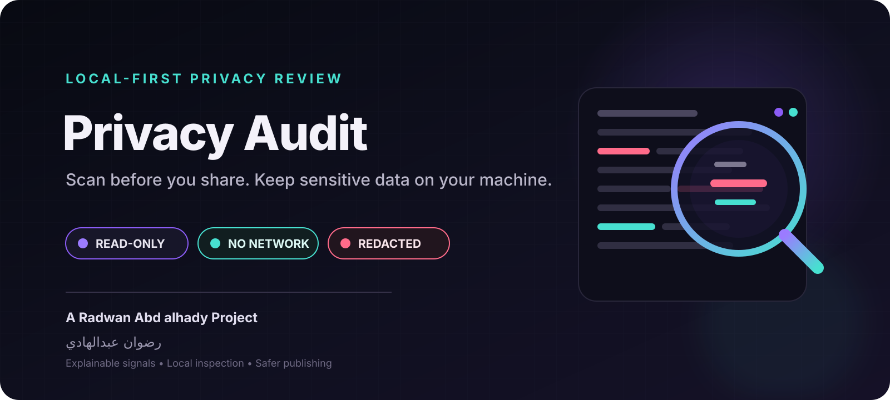

<div align="center">



<br/>


# Privacy Audit

**A dependency-free, read-only privacy scanner for source trees and text files.**

<div dir="rtl">
<strong>أداة محلية للقراءة فقط تساعدك على اكتشاف مؤشرات البيانات الحساسة قبل مشاركة الملفات أو نشر المستودع.</strong>
</div>

<br/>

[](https://github.com/rad03i2/privacy-audit/actions/workflows/ci.yml)


**[English guide](README_EN.md) · [الدليل العربي](README_AR.md) · [Architecture](docs/ARCHITECTURE.md) · [Brand](docs/BRAND.md) · [Security](SECURITY.md)**

</div>

---

## Review locally before you publish

Privacy Audit scans UTF-8 text locally and reports **review signals** for material that may deserve attention before a folder, repository, or text file is shared.

<table>
<tr>
<td width="33%"><strong>Local by design</strong><br/><sub>The scanner reads files on your machine and contains no runtime network client, account flow, telemetry, or API-key requirement.</sub></td>
<td width="33%"><strong>Explainable findings</strong><br/><sub>Each finding includes a rule, severity, file path, line number, description, and a deliberately redacted excerpt.</sub></td>
<td width="33%"><strong>CI-friendly</strong><br/><sub>Use JSON output or <code>--fail-on</code> thresholds to add a lightweight pre-publication gate to scripts and CI.</sub></td>
</tr>
</table>

Privacy Audit is intentionally conservative: it helps surface suspicious patterns, but it does **not** claim that every finding is a real secret or that a clean scan proves a project is private-data free.

## What it detects today

| Rule | Severity | What it flags |
|---|---:|---|
| `email` | Low | Possible email addresses |
| `ipv4` | Low | IPv4 addresses |
| `generic-secret` | Medium | Credential-like assignments such as API keys, passwords, secrets, or tokens |
| `private-key` | High | Private-key headers |
| `aws-access-key` | High | AWS-style access-key identifiers |
| `github-token` | High | GitHub-style token patterns |

Findings are heuristic. Rule names and severities are signals for review rather than proof of compromise or identity.

## 30-second start

**Requirement:** Python 3.10 or newer.

```bash
git clone https://github.com/rad03i2/privacy-audit.git
cd privacy-audit
python -m pip install .
privacy-audit --version
```

Scan a project:

```bash
privacy-audit ./project
```

Machine-readable output:

```bash
privacy-audit ./project --json
```

Fail a CI step when a medium-or-higher finding exists:

```bash
privacy-audit . --fail-on medium
```

## Scan flow

```text
file / source tree
       │
       ▼
local traversal
       │
       ├── skip symlinks
       ├── skip common generated/dependency dirs
       └── enforce max file size
       │
       ▼
text boundary
       │
       ├── skip likely binary files
       └── decode UTF-8 / UTF-8 BOM
       │
       ▼
conservative pattern rules
       │
       ▼
finding + severity + redacted excerpt
       │
       ├── terminal output
       └── JSON output / CI threshold
```

## CLI reference

| Command / flag | Behavior |
|---|---|
| `privacy-audit PATH` | Scan one file or a directory tree |
| `--json` | Emit summary and findings as JSON |
| `--max-bytes N` | Change the per-file inspection ceiling |
| `--fail-on low\|medium\|high` | Exit 2 when a finding reaches that severity or higher |
| `--version` | Print the installed version |

Default maximum file size: **2,000,000 bytes**.

Exit codes:

| Code | Meaning |
|---:|---|
| `0` | Scan completed and the configured threshold was not reached |
| `1` | Invalid target or read-related input failure |
| `2` | The configured `--fail-on` threshold was reached |

## What the scanner skips

Privacy Audit deliberately avoids pretending to understand content outside its current text boundary.

It skips or does not inspect:

- symbolic-link targets;
- files above the configured size ceiling;
- likely binary files containing a NUL byte near the start;
- files that cannot be decoded as UTF-8 / UTF-8 BOM;
- common generated/dependency directories including `.git`, `.venv`, `venv`, `node_modules`, `dist`, `build`, and `__pycache__`.

## Python API

```python
from privacy_audit import scan_path, scan_text

findings, summary = scan_path("./project")

for finding in findings:
    print(finding.rule, finding.severity, finding.path, finding.line)

inline = scan_text("Contact: person@example.com")
```

The public API exports `Finding`, `scan_path`, and `scan_text`.

## Privacy and safety boundary

The implementation is read-only and local:

- no scanned file is modified;
- no symbolic-link target is followed;
- no network request is required by the scanner;
- no account, API key, or `.env` configuration is required;
- scanned content is not intentionally persisted by the tool.

However, **reports can still be sensitive** because paths, rule names, and even redacted context can reveal useful information. Treat scan output as review material, not as something to publish automatically.

Read [SECURITY.md](SECURITY.md) for the complete boundary.

## Tests and CI

Run the same checks used by the repository:

```bash
python -m compileall -q src tests
python -m unittest discover -s tests -v
privacy-audit --version
```

GitHub Actions currently runs those checks on:

| Operating system | Python |
|---|---|
| Ubuntu | 3.10 · 3.12 · 3.13 |
| Windows | 3.10 · 3.12 · 3.13 |
| macOS | 3.10 · 3.12 · 3.13 |

The test suite covers redaction, email/private-key detection, UTF-8 input, binary skipping, file-size limits, invalid targets, and CLI severity thresholds.

## Current limitations

Privacy Audit is a **heuristic pre-publication aid**. It is not a DLP system, secret manager, malware scanner, privacy certification, or compliance engine.

The current implementation does not inspect:

- archives;
- images;
- PDF files as documents;
- Office formats;
- Git history;
- remote repositories or cloud services;
- semantic meaning beyond the implemented text patterns.

False positives and false negatives are possible. A scan with zero findings is **not proof** that the content contains no sensitive information.

Future ideas live in [ROADMAP.md](ROADMAP.md) and are kept separate from current capabilities.

## Repository map

```text
privacy-audit/
├── assets/
│   ├── project-cover.svg
│   └── project-logo.svg
├── docs/
│   ├── ARCHITECTURE.md
│   └── BRAND.md
├── src/privacy_audit/
│   ├── __init__.py
│   ├── __main__.py
│   ├── cli.py
│   └── scanner.py
├── tests/
│   └── test_scanner.py
├── .github/
│   ├── ISSUE_TEMPLATE/
│   ├── PULL_REQUEST_TEMPLATE.md
│   └── workflows/ci.yml
├── README_EN.md
├── README_AR.md
├── ROADMAP.md
├── CHANGELOG.md
├── SECURITY.md
├── CONTRIBUTING.md
└── LICENSE
```

## Documentation

| Document | Purpose |
|---|---|
| [README_EN.md](README_EN.md) | Complete English guide |
| [README_AR.md](README_AR.md) | الدليل العربي الكامل |
| [docs/ARCHITECTURE.md](docs/ARCHITECTURE.md) | Scanner flow, rules, boundaries, and exit behavior |
| [docs/BRAND.md](docs/BRAND.md) | Visual identity and asset rules |
| [SECURITY.md](SECURITY.md) | Privacy/security model and reporting |
| [CONTRIBUTING.md](CONTRIBUTING.md) | Contribution rules and test expectations |
| [ROADMAP.md](ROADMAP.md) | Clearly labeled future ideas |
| [CHANGELOG.md](CHANGELOG.md) | Notable project changes |

---

<div align="center">

### Built by رضوان عبدالهادي

**Radwan Abd alhady Ahmed · [@rad03i2](https://github.com/rad03i2)**

<sub>Inspect locally. Redact deliberately. Publish with more context.</sub>

</div>
